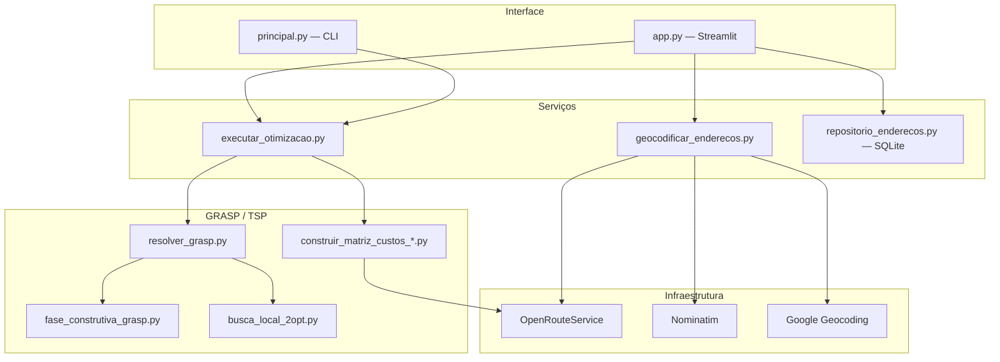

# Problema do Caixeiro Viajante com GRASP


Otimização de rotas de entrega com a meta-heurística **GRASP** e busca local **2-opt**, aplicada a um caso real em **Russas-CE**. O projeto inclui **CLI**, **interface web Streamlit** com mapa interativo e integração com APIs de roteamento e geocodificação.

**Repositório:** [github.com/GabrielSTCC/problema-caixeiro-viajante-grasp](https://github.com/GabrielSTCC/problema-caixeiro-viajante-grasp)

---

## Índice

- [Sobre o projeto](#sobre-o-projeto)
- [Destaques](#destaques)
- [Demonstração](#demonstração)
- [Stack tecnológica](#stack-tecnológica)
- [Arquitetura](#arquitetura)
- [Algoritmo GRASP](#algoritmo-grasp)
- [Interface web](#interface-web)
- [Estrutura do repositório](#estrutura-do-repositório)
- [Como executar](#como-executar)
- [Variáveis de ambiente](#variáveis-de-ambiente)
- [Testes](#testes)
- [Contexto acadêmico](#contexto-acadêmico)
- [Autor](#autor)
- [Licença](#licença)

---

## Sobre o projeto

Dado um **depósito** e vários **pontos de entrega**, o sistema encontra a ordem de visita que **minimiza a distância total** percorrida — o clássico **TSP (Traveling Salesman Problem)**, problema **NP-difícil**.

Em vez de busca exaustiva, o projeto usa **GRASP** (*Greedy Randomized Adaptive Search Procedure*): construção gulosa aleatorizada + melhoria local **2-opt**, com matriz de custos baseada em **distâncias reais de estrada** via [OpenRouteService](https://openrouteservice.org/).

| Entrada | Processamento | Saída |
|---------|---------------|-------|
| Depósito + entregas com coordenadas | Matriz de distâncias + GRASP + 2-opt | Rota otimizada, custo em km, mapa visual |

---

## Destaques

- **Meta-heurística GRASP** com RCL parametrizável (`α`) e múltiplas iterações
- **Busca local 2-opt** para eliminar cruzamentos e refinar cada solução
- **Distâncias reais** via ORS Matrix API, com fallback **Haversine** para desenvolvimento offline
- **Interface Streamlit** com editor de endereços, matriz interativa, histórico de melhorias e mapa Folium
- **Persistência SQLite** de endereços com geocodificação automática (ORS, Google ou Nominatim)
- **Arquitetura em camadas** — algoritmo, serviços, infraestrutura de APIs e UI separados
- **CLI e web** compartilham a mesma lógica de otimização em `servicos/executar_otimizacao.py`

---

## Demonstração

### Interface web

Execute `py -m streamlit run app.py` e explore as abas:

| Aba | O que mostra |
|-----|--------------|
| **Endereços** | Depósito e entregas editáveis, geocodificação automática |
| **Matriz** | Distâncias em km entre todos os pares de pontos |
| **Resultado** | Custo total, ordem de visita e evolução por iteração |
| **Mapa** | Rota visual com marcadores numerados sobre as ruas |

> **Dica para o README:** adicione capturas de tela em `docs/assets/` (ex.: `docs/assets/demo-mapa.png`) e referencie aqui para enriquecer o portfólio visualmente.

### Linha de comando

```bash
py principal.py
```

Exibe endereços, matriz de distâncias, progresso do GRASP e a melhor rota encontrada.

---

## Stack tecnológica

| Camada | Tecnologias |
|--------|-------------|
| Linguagem | Python 3.10+ |
| Algoritmo | GRASP, 2-opt, Haversine |
| Interface | Streamlit, Folium, streamlit-folium, Pandas |
| Dados | SQLite, python-dotenv |
| APIs externas | OpenRouteService (Matrix + Directions + Geocode), Nominatim, Google Geocoding (opcional) |

---

## Arquitetura



---

## Algoritmo GRASP

### 1. Matriz de custos

Coordenadas dos endereços são enviadas à **ORS Matrix API**, que retorna distâncias de condução em metros. O projeto converte para quilômetros e monta uma matriz `n × n`.

Existe fallback **Haversine** (linha reta) em `grasp/construir_matriz_custos_haversine.py` para testes sem API.

### 2. Fase construtiva

A cada iteração, a rota é construída a partir do depósito:

1. Para cada nó atual, calcula o custo até todos os não visitados
2. Monta a **Lista de Candidatos Restrita (RCL)** com nós cujo custo ≤ `C_min + α × (C_max - C_min)`
3. Escolhe **aleatoriamente** um candidato da RCL
4. Repete até visitar todos os nós

| α | Comportamento |
|---|---------------|
| `0` | Guloso puro — sempre o mais barato |
| `1` | Máxima aleatoriedade |
| `0.3` | Padrão — diversificação com viés para custos menores |

### 3. Busca local 2-opt

Após cada construção, **2-opt** troca pares de arestas enquanto houver melhoria, eliminando cruzamentos.

### 4. Iterações

Construção + 2-opt repetem por `GRASP_MAX_ITERATIONS` vezes. A melhor rota global é retornada.

**Complexidade:** `O(k × n²)`, onde `k` = iterações e `n` = pontos.

---

## Interface web

Além do CLI, [`app.py`](app.py) oferece uma interface visual para configurar, executar e analisar a otimização.

### Fluxo

1. **Endereços** — edite depósito e entregas persistidos em **SQLite** (`dados/enderecos.db`). Ao alterar um endereço, latitude/longitude são buscadas automaticamente.
2. **Calcular rota** (barra lateral) — geocodifica pendências e executa GRASP com **α**, iterações e modo ORS/Haversine.
3. **Matriz**, **Resultado** e **Mapa** só exibem dados se os endereços não mudaram desde o último cálculo.

### Persistência de endereços

| Ação | Comportamento |
|------|---------------|
| Adicionar entrega | Salva no banco; geocodifica ao preencher o endereço |
| Editar endereço | Geocodifica automaticamente as linhas alteradas |
| Excluir linha | Marca como inativo; some da UI e invalida resultado |
| Restaurar padrão | Repovoa com os 7 endereços de Russas-CE |

O arquivo `dados/enderecos.db` é criado na primeira execução e **não é versionado**.

### Mapa da rota

A aba **Mapa** usa [Folium](https://python-visualization.github.io/folium/):

- Marcador verde no **depósito** (início e fim)
- Marcadores numerados nas **entregas**, na ordem do tour
- Traçado da rota sobre o mapa

| Modo | Matriz de custos | Linha no mapa |
|------|------------------|---------------|
| ORS (com API key) | Distâncias de condução (km) | Rota sólida pelas ruas |
| Haversine (fallback) | Distância em linha reta (km) | Linha tracejada entre pontos |

---

## Estrutura do repositório

```
.
├── app.py                                # Interface web Streamlit
├── principal.py                          # Ponto de entrada CLI
├── servicos/
│   ├── executar_otimizacao.py            # Orquestração matriz + GRASP
│   ├── geocodificar_enderecos.py         # Geocodificação multi-provedor
│   └── estado_enderecos.py               # Validação de consistência
├── ui/componentes/                       # Editor de endereços e mapa Folium
├── dados/
│   ├── enderecos_russas.py               # Seed padrão Russas-CE
│   └── repositorio_enderecos.py          # Persistência SQLite
├── grasp/
│   ├── resolver_grasp.py                 # Loop GRASP completo
│   ├── fase_construtiva_grasp.py         # Fase construtiva com RCL
│   ├── busca_local_2opt.py               # Melhoria local 2-opt
│   └── construir_matriz_custos_*.py      # Matriz ORS e Haversine
├── infraestrutura/roteamento/            # Clientes ORS, Nominatim, Google
├── tests/                                # Testes de geocodificação
├── requirements.txt
├── .env.example
└── .gitignore
```

---

## Como executar

### Pré-requisitos

- **Python 3.10+**
- Conta gratuita na [OpenRouteService](https://openrouteservice.org/dev/#/signup) (recomendado para distâncias reais)

### Instalação

```bash
git clone https://github.com/GabrielSTCC/problema-caixeiro-viajante-grasp.git
cd problema-caixeiro-viajante-grasp
py -m pip install -r requirements.txt
```

### Configuração

```bash
copy .env.example .env   # Windows
# cp .env.example .env   # Linux/macOS
```

Edite `.env`:

```env
ORS_API_KEY=sua_chave_aqui
GOOGLE_MAPS_API_KEY=     # opcional — geocodificação mais precisa
GRASP_ALPHA=0.3
GRASP_MAX_ITERATIONS=100
```

> O arquivo `.env` **não** é versionado. Nunca commite chaves de API.

### Execução

**CLI:**

```bash
py principal.py
```

**Interface web:**

```bash
py -m streamlit run app.py
```

Na barra lateral, ajuste **α**, **iterações GRASP** e escolha entre distâncias reais (ORS) ou Haversine.

---

## Variáveis de ambiente

| Variável | Descrição | Padrão |
|----------|-----------|--------|
| `ORS_API_KEY` | Chave OpenRouteService (Matrix, Directions, Geocode) | — |
| `GOOGLE_MAPS_API_KEY` | Geocodificação Google (opcional) | — |
| `GRASP_ALPHA` | Parâmetro α da RCL (0 a 1) | `0.3` |
| `GRASP_MAX_ITERATIONS` | Número de iterações GRASP | `100` |

Sem `ORS_API_KEY`, o sistema usa **Haversine** automaticamente.

---

## Testes

```bash
py -m unittest discover -s tests -v
```

Alguns testes de integração com Google Geocoding exigem `GOOGLE_MAPS_API_KEY` configurada.

---

## Contexto acadêmico

Projeto desenvolvido na disciplina **Projeto e Análise de Algoritmos (PAA)**, explorando meta-heurísticas aplicadas a problemas de otimização combinatória.

**Caso de estudo:** depósito e 7 entregas em Russas-CE (dados em `dados/enderecos_russas.py`).

---

## Autor

**Gabriel** — [GitHub @GabrielSTCC](https://github.com/GabrielSTCC)

---

## Licença

Este projeto está sob a licença [MIT](LICENSE). Uso livre para fins educacionais e de portfólio.
